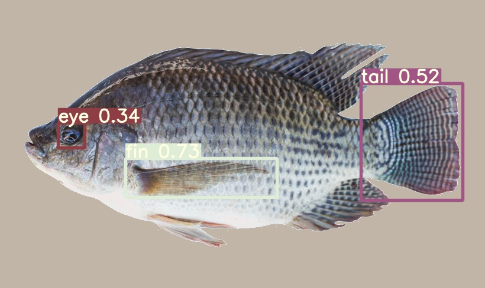
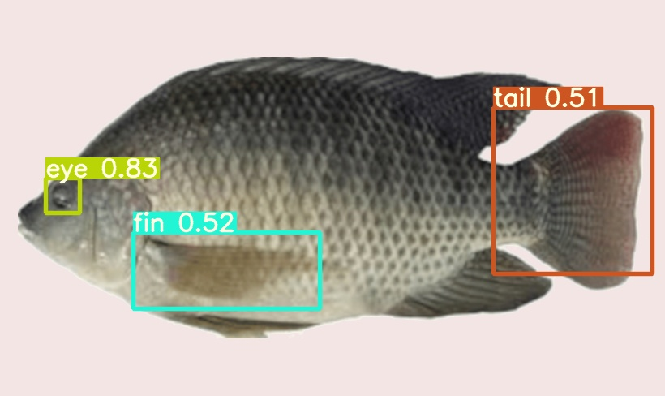
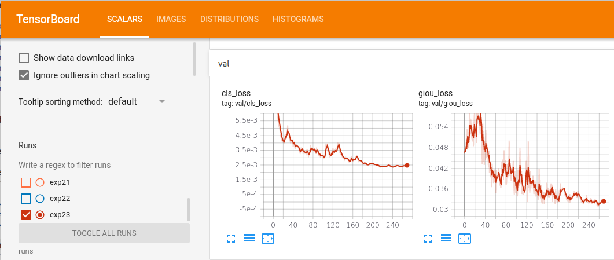
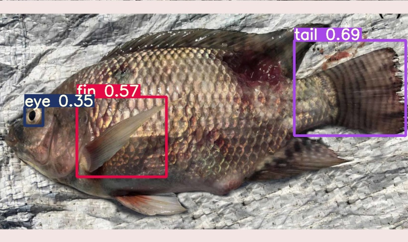

# TILAPIA EYE FIN TAIL classifer
* This is a project I undertook in SUMMER 2020.
* I wanted a classifier so that I could triangulate an area where I could inspect a fish body.



# Summary

* I use pytorch's torchvision in order to augment 6 images into 200 train and validation. These are the transformations I used.
```
    transforms = torchvision.transforms.Compose([
      torchvision.transforms.Pad(400, padding_mode="edge"),
      torchvision.transforms.RandomRotation(30, resample=PIL.Image.BICUBIC),
      torchvision.transforms.ColorJitter(brightness=CJ,contrast=CJ,saturation=CJ,hue=(-.1,.1)),
      torchvision.transforms.RandomHorizontalFlip(),
      torchvision.transforms.RandomAffine(30, scale=(.80,1.0), resample=PIL.Image.BICUBIC),
      torchvision.transforms.CenterCrop(800)
      ])
```
* I labeled them in the YOLO format.
* The main classifer used is [YOLOv5](https://github.com/ultralytics/yolov5), I decided to use this for 2 reasons.
>1. It's reported speed interested me (maximum of 416 frames per second when using the small model)
>2. I wanted to use it as a base to better understand PyTorch.
* My test results on 13 completely unseen (not augmented) tilapia images.
```
precision = 88.57 %
recall    = 81.58 % 
F_measure = 84.93 % 
```
* The resulting images from my previous tests are included in the media directory, I'll show some now.

* I used the original large model as a starting off point. The following is the validation loss.



# Instructions to detect
Running the following will produce images like what is found in the media directory.
```
python3 detect.py --weights './weights/tilapia_l.pt' --img 416 --conf 0.3 --source ./data/test
```

# Instructions to augment images
The training_prep script augments the images.
It takes an absolute path to the train and valid directories that I included in my data directory.
### example :
```
cd ./tilapia_eye_fin_tail_classifier # you shouldve been here already if you ran detect.py
python3 training_prep.py $PWD/data/train
python3 training_prep.py $PWD/data/valid
```
From here I leave some template YOLO formatted labels, I used a program to label them and you can find many online. (example : [labelImg](https://github.com/tzutalin/labelImg) )
In the future I would spend more time on working on labeling the original images and using known values from transforms to autolabel. (Such a task may require something other than torchvision)

# GENERAL Instructions to train it using YoloV5
You should follow the YOLOv5 instructions, I am putting this here for my own convenience.
```
Here, we are able to pass a number of arguments:

    img: define input image size
    batch: determine batch size
    epochs: define the number of training epochs. (Note: often, 3000+ are common here!)
    data: set the path to our yaml file
    cfg: specify our model configuration
    weights: specify a custom path to weights. (Note: you can download weights from the Ultralytics Google Drive folder)
    name: result names
    nosave: only save the final checkpoint
    cache: cache images for faster training
```

```
python3 train.py --img 255 --batch 16 --epochs 10 --data '../tilapia/classes/data.yaml' --cfg ./models/yolov5l.yaml --weights './weights/yolov5l.pt' --name yolov5s_results  --cache
```



# Requirements

```
Distributor ID:	Ubuntu
Description:	Ubuntu 20.04.1 LTS
Release:	20.04
Codename:	focal
```

* all YOLOv5 requirements, please visit their github. 


